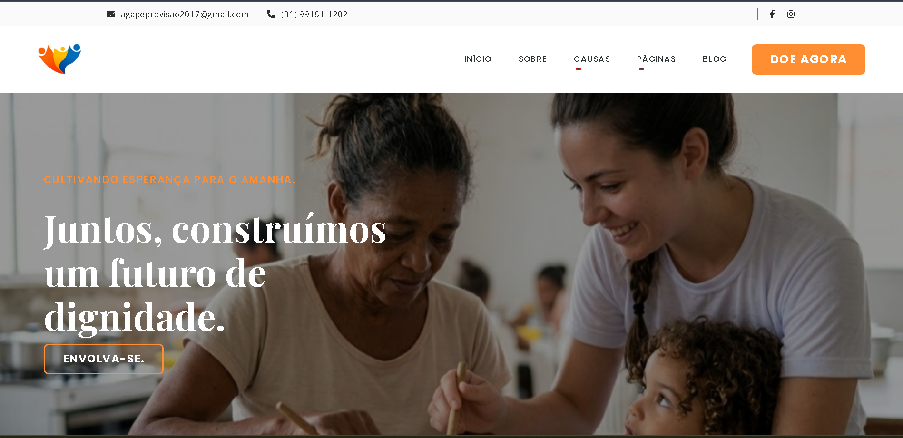

# 🌻 ONG Ágape Provisão - Plataforma Web

## 📖 Sobre o Projeto
A plataforma web da **ONG Ágape Provisão** foi desenvolvida para digitalizar e expandir o alcance da organização, que atua transformando a realidade de famílias em situação de vulnerabilidade desde 2016. O site serve como um portal centralizado para captação de recursos, engajamento de voluntários, transparência de dados e divulgação das causas e projetos sociais (como a Creche Maria Eurípedes e o Projeto Dandara).

## ✨ Principais Funcionalidades
O projeto foi pensado para oferecer uma experiência imersiva e facilitar a conversão de doadores e voluntários, contando com:
* **Integração PIX Inteligente:** Botões interativos que copiam automaticamente o CNPJ da ONG para a área de transferência, exibindo um alerta visual de sucesso.
* **Assinatura Digital Integrada:** Uso da biblioteca `signature_pad` para permitir que voluntários online assinem o termo de compromisso diretamente pelo navegador.
* **Transparência Animada:** Contadores dinâmicos (Intersection Observer API) que revelam os números de impacto social conforme o usuário rola a página.
* **Elementos 3D e Parallax:** Efeitos imersivos de rolagem (Parallax) e uso do `<model-viewer>` para exibir elementos tridimensionais diretamente no blog.
* **Carrosséis e Galerias:** Sliders dinâmicos para banners principais, parceiros e galerias de fotos utilizando o Bootstrap Carousel e o OwlCarousel2.
* **Integração com Mercado Pago:** Botões de doação com valores pré-definidos que redirecionam o usuário direto para o checkout de pagamento.

## 🛠️ Tecnologias Utilizadas
* **HTML5 / CSS3:** Estruturação semântica e estilização customizada.
* **JavaScript (Vanilla):** Lógica para animações de contadores, efeito de máquina de escrever e funcionalidade de cópia do PIX.
* **Bootstrap 5.3.2:** Framework CSS para grid responsivo, modais, acordeões e navegação.
* **FontAwesome 6.4.2:** Biblioteca de ícones vetoriais.
* **Google Fonts:** Tipografia elegante mesclando *Playfair Display*, *Poppins*, *Open Sans* e *Inter*.
* **OwlCarousel2:** Criação do slider interativo para a seção de equipe/voluntários.
* **Model-Viewer:** Renderização do dirigível 3D na seção do blog.
* **Signature Pad:** Canvas para captura de assinatura manual na tela de voluntários online.

## 📂 Estrutura das Páginas
1.  `index.html`: Página inicial com banners imersivos, visão geral das causas, metas de arrecadação e painel de transparência.
2.  `sobre.html`: Detalhamento da missão, visão, equipe de voluntários (Slider) e galeria de fotos.
3.  `voluntarios.html`: Segmentação entre voluntariado presencial e online, contendo o modal de assinatura digital de termos.
4.  `doacao.html`: Central de arrecadação com valores fixos sugeridos, chave PIX e lista de necessidades materiais para doação física.
5.  `blog_agape.html`: Espaço estilo "Manifesto" para artigos, reflexões sobre inclusão e galeria de fotos 3D.
6.  `cadastro-escolar.html`: Guia de matrícula da creche, documentos necessários, rotina diária em formato de linha do tempo e FAQ (Perguntas Frequentes).